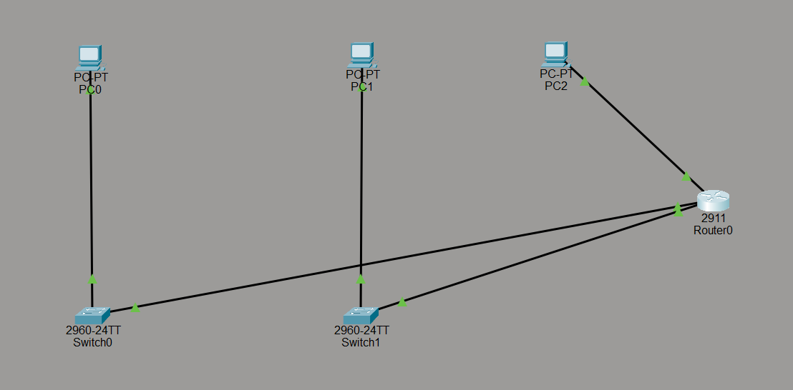

# Network Security & Access Control (ACLs) - Cisco Packet Tracer

This project demonstrates the implementation of network security policies using **Extended Access Control Lists (ACLs)** on a Cisco router within a multi-subnet topology. It is part of my vocational training (*Ausbildung*) portfolio to showcase practical networking and security skills.

---

## 🏗️ Network Topology
The network consists of three distinct subnets connected to a central Cisco 2911 router:
* **Subnet 1 (`PC0`):** `192.168.10.0/24` (Gateway: `192.168.10.1`)
* **Subnet 2 (`PC1`):** `192.168.20.0/24` (Gateway: `192.168.20.1`)
* **Subnet 3 (`PC2`):** `192.168.30.0/24` (Gateway: `192.168.30.1`)



---

## 🛡️ Security Policy & Objective
The primary objective is to enforce network segmentation and security by restricting specific host communication:
* **Rule:** Prevent `PC0` (`192.168.10.2`) from accessing Subnet 2 (`192.168.20.0/24`).
* **Allow:** All other traffic across the network remains permitted under standard routing rules.

---

## ⚙️ Configuration
An **Extended ACL (ID 100)** was configured on `Router0` and applied inbound on the interface facing `PC0`:

```text
enable
configure terminal

! Define Extended ACL to block PC0 from reaching Subnet 2
access-list 100 deny ip host 192.168.10.2 192.168.20.0 0.0.0.255
access-list 100 permit ip any any

! Apply ACL to the ingress interface
interface gigabitEthernet 0/0
ip access-group 100 in
end
